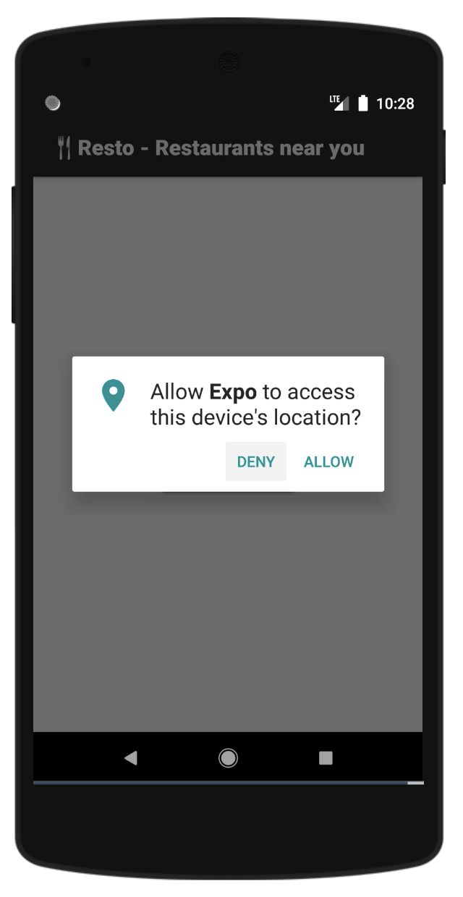
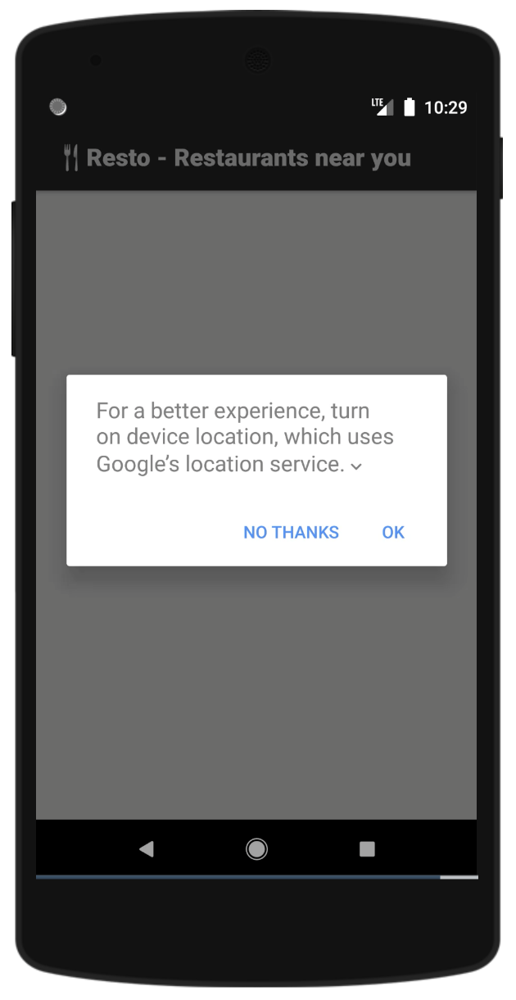
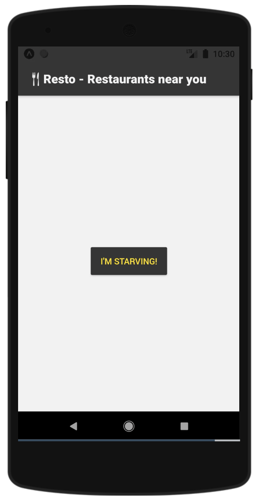
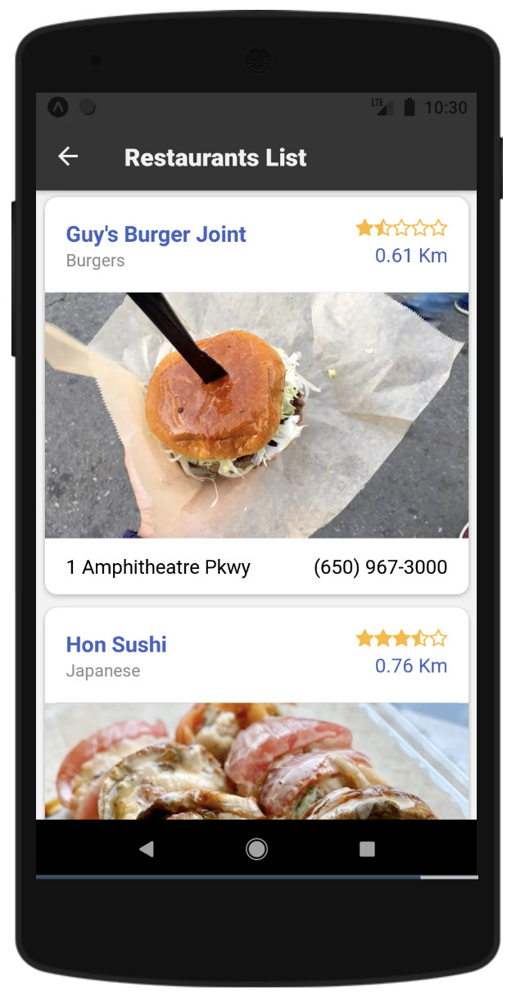
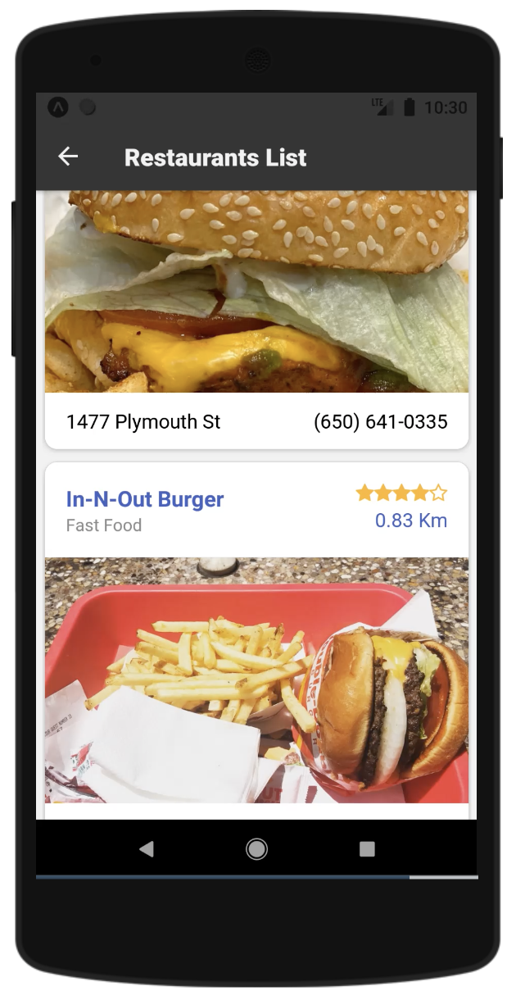
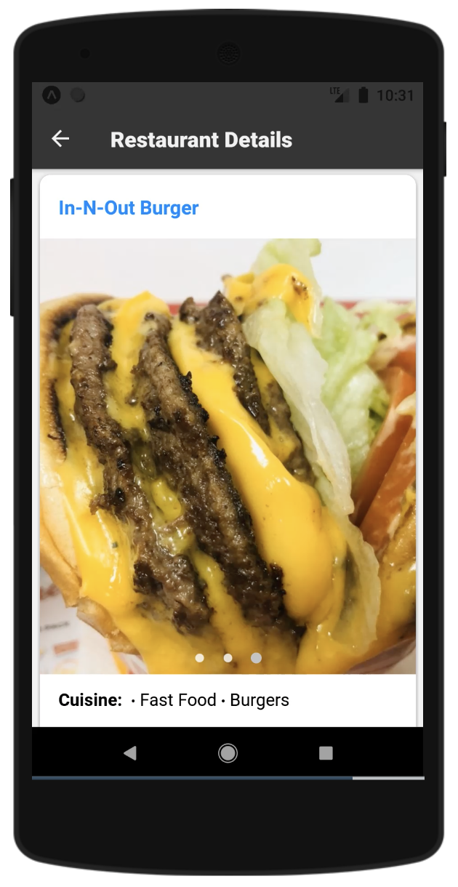
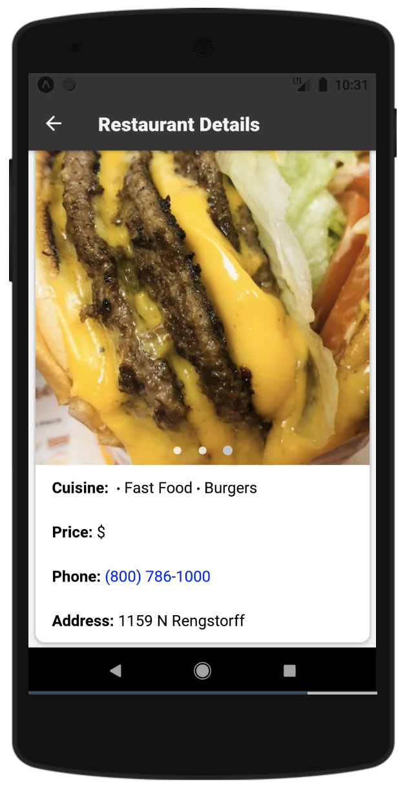
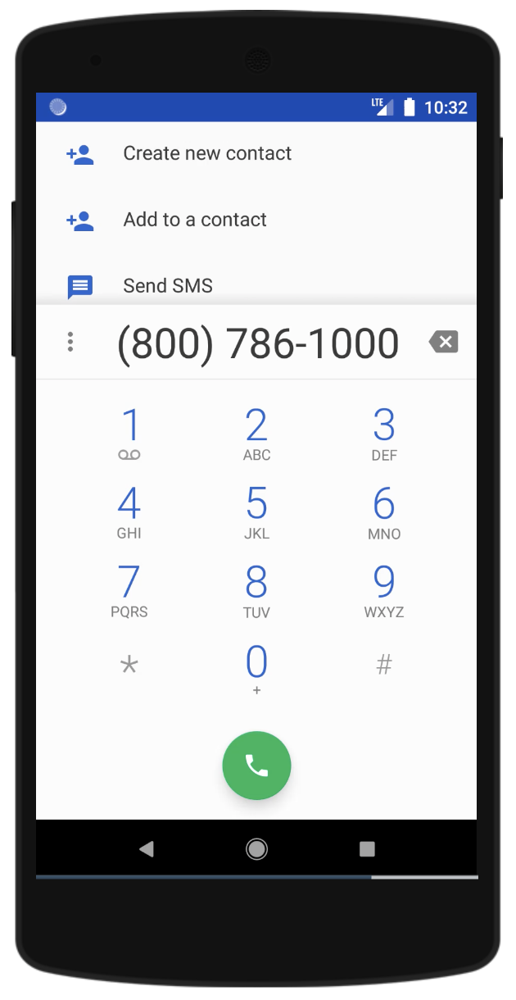

<p align="center">
  
</p>

# Resto - Yelp React Native App
React Native App created for iOS and Android with geolocation and Yelp API to locate restaurants near you.

See the [demos on Snack/Expo](https://snack.expo.io/@appdevcanada/near-you-restaurants-yelp?&preview=true&platform=android&supportedPlatforms=android,ios).

## Quickstart

First, clone the repository:

```bash
git clone https://github.com/appdevcanada/Near-You-Restaurants-Yelp.git rn-resto-yelp
cd rn-resto-yelp

# install the dependencies
npm install

# start the server
expo start
```

## Configuring the Application

This app uses [Yelp API](https://www.yelp.com/developers) for restaurants geolocation around you. In order to test the application, you can use my API key, but for your own development, please register there and get yours. After getting the API key, go to `/resources/Fetch.resource.js` and change the `this.apiKey=` to your API key value.

## Starting the Application

```bash
expo start
```

This will open the browser with the available options to test the application.
Select iOS or Android to open it in the simulator, or in your device. In order to run in simulators, you need to have them previously installed.
This app was not created to run/simulate in web browsers, only in mobile devices.

## Libraries We'll Use

This app uses the following technologies/libraries:

* expo/vector-icons
* react-native-community/masked-view
* react-navigation/native
* react-navigation/stack
* expo
* native-base
* react
* react-native
* react-native-gesture-handler
* expo-permissions
* expo-location
* And much much more

## Contributing

Fell free to clone this repository and contribute with more functionality, new ideas and improvements.

```shell
git clone https://github.com/appdevcanada/Near-You-Restaurants-Yelp.git rn-resto-yelp
cd rn-resto-yelp
npm install
expo start
```
___

## Screenshots

|  **iOS** 	|  **Android** 	|
|:-:	|---	|
| <p align="center"></p>	| <p align="center"></p> |
| <p align="center"></p>	| <p align="center"></p>	|
| <p align="center"></p>	| <p align="center"></p>	|
| <p align="center"></p>	| <p align="center"></p>	|
| <p align="center"></p>	| <p align="center"></p>	|
| <p align="center"></p>	| <p align="center"></p>	|
| <p align="center"></p>	| <p align="center"></p>	|
| <p align="center"></p>	| <p align="center"></p>	|
